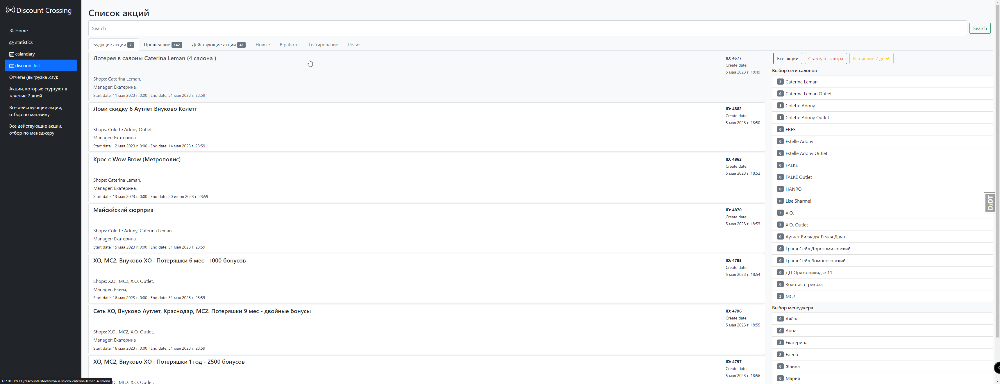
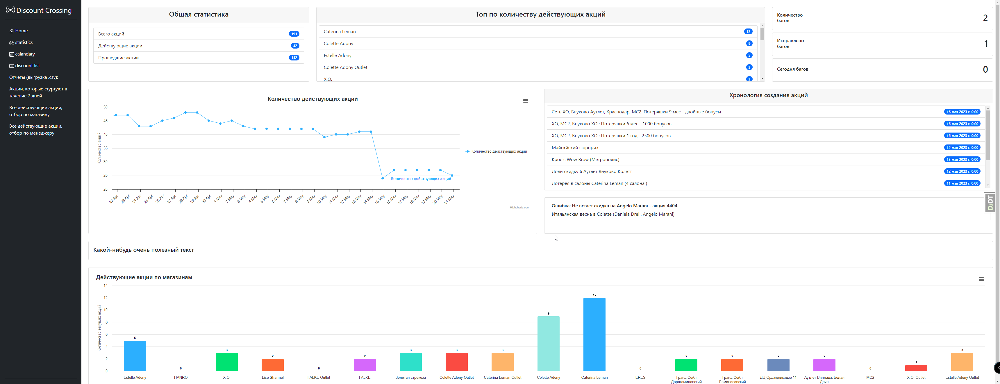

# stock_crossing (WORK IN PROGRES)
## Инструкция по установке и запуску проекта по мониторингу и отслеживанию маркетинговых акций

Следуйте этой инструкции для установки и запуска проекта Django 4.2:

### Предварительные требования

Убедитесь, что на вашем компьютере установлен Python версии 3.x и установщик пакетов pip. Если их нет, выполните следующие шаги:

1. Перейдите на официальный сайт Python (https://www.python.org) и загрузите последнюю версию Python 3.x для вашей операционной системы.
2. Запустите установщик Python и следуйте инструкциям по установке.
3. После завершения установки откройте командную строку и введите команду `python --version`, чтобы убедиться, что Python установлен корректно.
4. Введите команду `pip --version`, чтобы убедиться, что у вас установлен установщик пакетов pip. Если он не установлен, следуйте инструкциям на официальном сайте pip (https://pip.pypa.io/en/stable/installing/) для его установки.

### Установка проекта

1. Склонируйте репозиторий проекта с GitHub на свой локальный компьютер.
2. Перейдите в папку проекта в командной строке.

### Установка зависимостей

1. В командной строке выполните следующую команду: `pip install -r requirements.txt`
   Эта команда установит все необходимые пакеты и зависимости, указанные в файле requirements.txt.

### Запуск проекта

1. После успешной установки всех зависимостей выполните команду `python manage.py migrate`, чтобы создать необходимые таблицы базы данных.
2. Запустите сервер разработки Django с помощью команды `python manage.py runserver`.
   Сервер будет запущен по адресу http://127.0.0.1:8000/.

Теперь вы можете открыть свой веб-браузер и перейти по адресу http://127.0.0.1:8000/, чтобы увидеть работающий проект Django 4.2.

Успешной работы с проектом.

## Описание

Данный проект представляет собой систему мониторинга и отслеживания маркетинговых акций, с возможностью просмотра статистики по сетям магазинов и менеджерам. Он позволяет эффективно управлять акциями, анализировать их результаты и принимать соответствующие решения для улучшения маркетинговых стратегий.

### Основные возможности проекта

1. Discount List: Эта страница предоставляет список действующих, будущих и прошедших акций доступных в системе. Пользователь может просмотреть подробную информацию о каждой акции, включая ее название, описание, условия участия, сроки действия и привязанные магазины или менеджеры. Здесь пользователь также может создавать новые акции, редактировать или удалять существующие.

2. Statistic: Эта страница предоставляет графическую статистику по сетям магазинов и менеджерам. Пользователь может просмотреть динамику количества действующих акций в разрезе времени, чтобы оценить их эффективность и изменения со временем. Также здесь предоставляется хронология заведения акций, которая помогает отслеживать последовательность создания и изменения акций.

### Технологии и инструменты

Проект реализован с использованием следующих технологий и инструментов:

1. Фреймворк: Django 4.2
2. Язык программирования: Python 3.x
3. База данных: PostgreSQL
4. Frontend: HTML, CSS, JavaScript
5. Визуализация данных: библиотеки для построения графиков HighCharts.js
